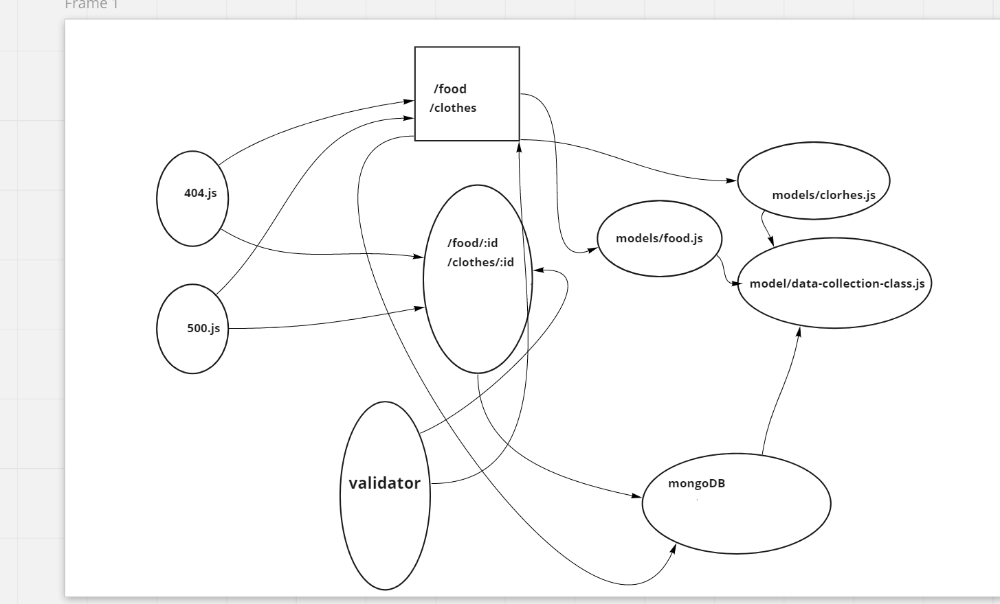

# api-server
- <a href=https://api-server-01.herokuapp.com/// class="icon fa-twitter">go to heroku app </a>

- <a href=https://github.com/nassir1976/api-server.git class="icon fa-twitter">go to gitHub </a>

- <a href=https://github.com/nassir1976/api-server/pull/1 class="icon fa-twitter"> pull request </a> 

# Phase 3 Requirements
- Build a REST API using Express, by creating a proper series of endpoints that perform CRUD operations on a Mongo Database, using the REST standard

## Data Models

- Create 2 Mongo data models using Mongoose, exported as Node Modules
- Create a Collection Class that accepts a Mongoose Model into the constructor and assigns it as this.model
- This class should have the following methods defined, to perform CRUD Operations
- Each method should in turn call the appropriate Mongoose method for the model
- create()
- get() or read()
- update()
- delete()

## Routes
In your express server, create a router module for each data model that you’ve created. Within the router module, create REST route handlers for each of the REST Methods that properly calls the correct CRUD method from the matching data model.

Add a Record

- CRUD Operation: Create
- REST Method: POST
- Path: /food
- Input: JSON Object in the Request Body
- Returns: The record that was added to the database.
- You must generate an ID and attach it to the object
- You should verify that only the fields you define get saved as a record

Get All Records

- CRUD Operation: Read
- REST Method: GET
- Path: /food
- Returns: An array of objects, each object being one entry from your database

Get One Record

- CRUD Operation: Read
- REST Method: GET
- Path: /food/1
- Returns: The object from the database, which has the id matching that which is in the path
- Update A Record
- CRUD Operation: Update
- REST Method: PUT
- Path: /food/1
- Input: JSON Object in the Request Body
- Returns: The object from the database, which has the id matching that which is in the path, with the updated/

changed data

- You should verify that only the fields you define get saved as a record
- Delete A Record
- CRUD Operation: Destroy
- REST Method: DELETE
- Path: /food/1
- Returns: The record from the database as it exists after you delete it (i.e. null)

### Documentation
- Compose a UML or Process/Data Flow Diagram for every application

